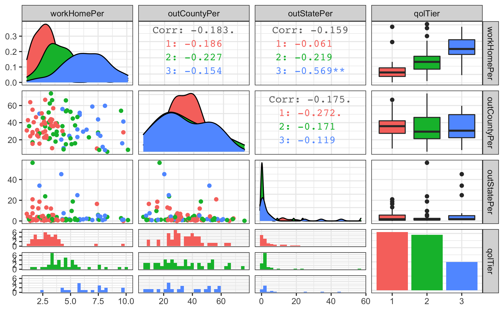
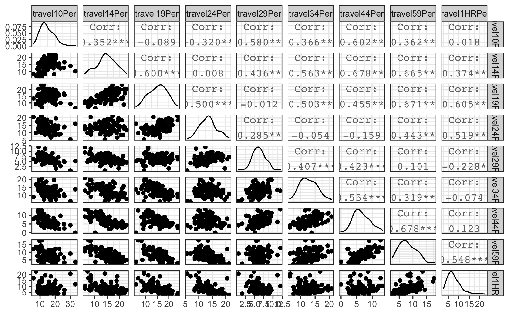
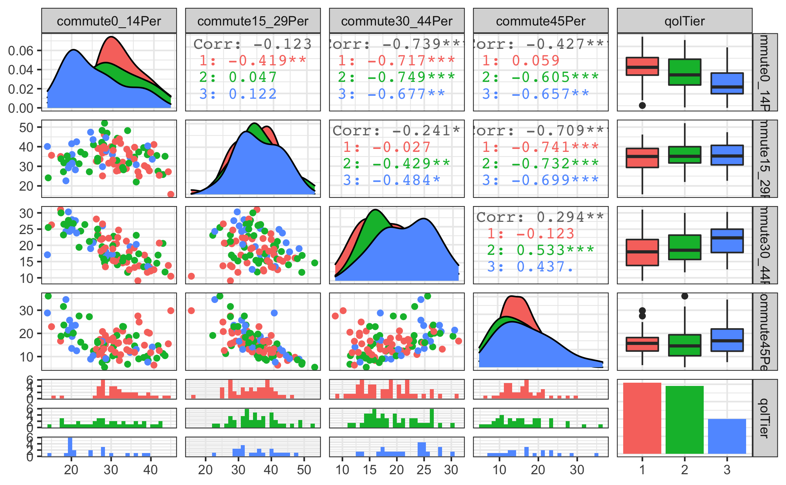
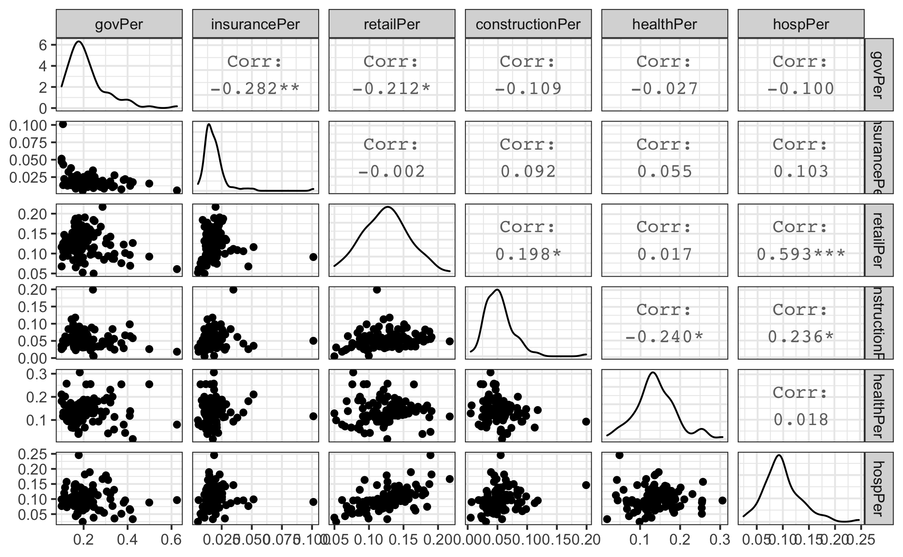
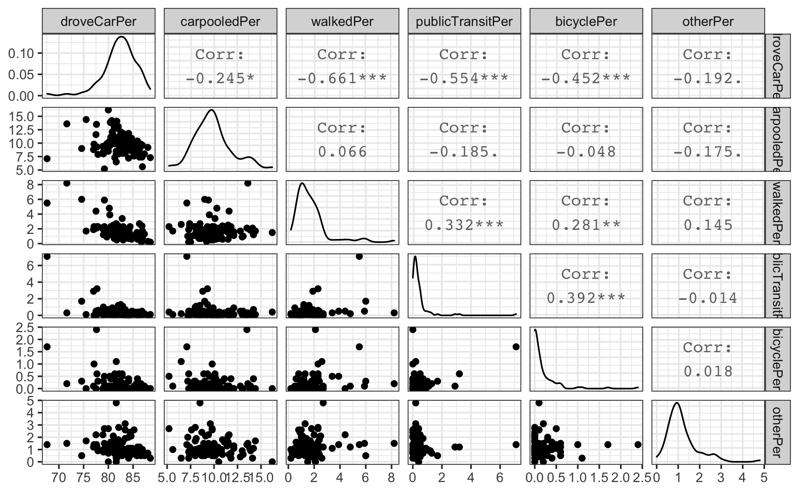

```{r setup, include=FALSE, message=FALSE, warning=FALSE}
knitr::opts_chunk$set(echo = FALSE,
                      message=FALSE, 
                      warning=FALSE,
                      out.width = "60%",
                      fig.align = "center")
```

```{r}
library(tidyverse)
library(readr)
library(dplyr)
library(kableExtra)
```

```{r}
multinomFullSimple <- read_csv("data/multinomFullSimple.csv")
multinomStepSimple <- read_csv("data/multinomFullStep.csv")

cnames<- c("term", "tier", "est.", "SE", "p-value",
           "tier ", "est. ", "SE ", "p-value ")

names(multinomFullSimple) <- cnames
names(multinomStepSimple) <- cnames
```


## Introduction
|        On March 30th, 2021, Andy Wu, an Assistant Professor of Business Administration at Harvard Business School published  an explosive research finding, one with huge implications for companies wondering whether to phase out remote work and telecommuting options at the conclusion of the COVID-19 pandemic: *commuting to work adversely affects both quantity and quality of worker output*. Further, the research found that commuting detracts from worker productivity at *any* level of employment. According to Wu, "any distance you can reduce the commute, you can gain in innovative productivity." At the time the study was conducted (2015 to 2017), the average worker in the United States commuted 54 minutes a day-- or 27 minutes each way. That time could prove quite costly; the research also states that “the total opportunity cost of commuting for workers can exceed their hourly wages, amounting to thousands of dollars per average worker per year, and this is before taking into account potential costs on workers’ subjective well-being [1].”
|        That 'subjective' well-being is worth mentioning; Wu's research comes on the heels of others who have established a strong relationship between commute time and health outcomes; those who have longer commutes have been shown to have higher rates of reported physical and mental health complaints [2]. Andy Wu's research, it seems, was further establishing a widely explored phenomenon: those who endure longer daily work commutes experience adverse effects, including lower levels of productivity and both physical and mental health. Already, it is clear that there is an incentivized interest in reducing commute time as long commutes can be detrimental to individual workers and firms which employ them. However, the question remains whether commute times have a strong relationship with other quality-of-life metrics, such as employment figures, population trends, and property tax rates.
|        This analysis will examine North Carolina counties as a case study; in particular, the analysis will seek to determine whether North Carolina counties can reliably be categorized into "quality of life" tiers based on the North Carolina Department of Commerce's 'County Distress Rankings,' which are described in greater detail in the Data section of this paper. Using empirical measurements related to a county's level of suburbanization and business opportunity, the included analyses seek to bolster the claim that worker commutes are not only harmful to individuals, but are also associated writ large with low measures of quality of life within county-level communities. By attaining high levels of predictive accuracy with only county-level commuting data, the case can be furthered that commuting times are indicative of an even wider array of quality-of-life factors. The stated goals of this analysis are as follows:

* Assess the validity of the claim that geographical areas with higher commute times and lower access to employment opportunities are strongly and negatively correlated with metrics often used as indicators for a region's quality of life.

* Attain the best-fit model achieving high predictive accuracy of a county's quality of life tier using data related to daily work commutes, employment, and levels of urbanization within North Carolina counties as predictors.

* Extend the scope of this research by validating this model using similar commute data and quality of life measures from other states. 

#### Background

|        Andy Wu's inclination that reduced commute times are intrinsically related to higher worker productivity is supported by well-established economic theory. In particular, the notion that it is ideal for workers to live near their employment district is central to the Alonso-Muth-Mills monocentric city model. This model, arguably the backbone of traditional urban economic thought, proposes that (with all conditions held equal) workers will choose to locate as closely as possible to their city's central business district (CBD). The resulting market outcome is higher demand for land closer to the central business district, which leads to a resulting adjustment in housing density and housing prices. Conversely, housing on the outer fringe of the city is expected to be more sparse, with lower property values and housing costs [3]. To what extent the Alonso-Muth model applies today is debatable; the model assumes identical preferences and income among workers as well as similar demand across employers. Further, the necessity of the monocentric city layout itself has waned with wider availability of transit and the onset of large suburban employment centers.
|        In the period immediately following the second World War in the United States, several factors combined to aid the the rapid growth of the American suburbs. Among them were technological advances such as construction of freeways, lower transportation and construction costs, and the formation of the Eisenhower Interstate Highway System; government policies which incentivized movement out of city-centers such as the low-interest mortgage programs of the Federal Housing Administration and Veterans Affairs; and other supply side factors such as cheap land around city outskirts in conjuction with emerging contractors and developers [4]. As a result of the same factors, the job sector has been increasingly suburabinzed in the United States since the 1950s. One notable example of this trend, Chicago, lost 211,000 jobs in just the ten years between 1960 and 1970, while the surrouding suburbs gained 548,000 jobs in this time [5].
|        According to Michael Rothstein in his 2018 book *The Color of Law*, people of color were systematically excluded from this suburbanization by explicit practices of both private institutions and government organizations. For example, the aforementioned FHA program relied on maps created by the Home Owners' Loan Corporation and local municipalities which assessed loan risk to be extremely correlated with certain spatial demographic lines. This risk was purportedly high in segregated urban neighborhoods which predominately contained people of color as compared to similar white neighborhoods. As a consequence of being unable to secure low-interest mortgages in new suburban areas, African American and other minority communities were generally unable to partake in the construction of single-family housing units that allowed for mass relocation to the suburbs [6]. Another barrier to the entry of these communities was, ironically, the construction of the Eisenhower Interstate Highway System. Many African Americans and other people of color were, in several cases, driven further from the suburbs by the construction of these interstates when it was used as justification for slum clearance. Even ignoring this fact, there is evidence that the construction of the interstate highway system, while providing and enormous boost to most suburban industries, actually hindered the development of several more primarily urban and rural-based economies [7].
|        Because the suburbanization that occurred during the latter half of the 20th century excluded people of color living in urban communities as well as rural whites, the movement of several employment centers to the suburbs became another barrier of access to skilled and high-wage careers for those demographics. Longer commutes meant higher transportation costs as well as increased time commitments [8]. Additionally, many living in these areas did not have sufficient means of transport (and may not have owned vehicles at all). Lagging public transport progress and the lack of a major rail-transit option in many cities further stunted access to the newly forming suburban industries for several decades, and vehicle ownership and access to public transit continue to be influential factors in local employment rates [9].
|        In an effort to address some of these concerns, Congress authorized the Federal Transit Administration to create the Job Access and Reverse Commute (JARC) Program in 1998. The program had the stated goal of improving "access to transportation services to employment and employment related activities for welfare recipients and eligible low-income individuals and to transport residents of urbanized areas and non-urbanized areas to suburban employment opportunites [10]." In practice, the program involved federal grants to states, local governments, and other non-profit actors aiming to increase public transportation options and career resources for these individuals. JARC was met with limited success and ultimately was repealed in 2012 by President Obama (though many of its functions were replaced by the new Moving Ahead for Progress in the 21st Century Act) [11]. In North Carolina, which receives JARC funding through its Department of Transportation, several localities have participated in the program. These localities are primarily focused on providing for the transportation of low-income, disabled and elderly persons. It is worth noting that, while these programs are helpful in addressing commuting needs of those who would otherwise be excluded from suburban labor markets, they generally do little to address the access needs of the rural and urban populous who do not meet these relatively strict standards and still face obstacles in transportation.

#### Literature Review

|        At the time of the writing of this paper, there has been ample research to suggest that commute times might have a close relationship with some measures traditionally associated with quality of life. As mentioned previously in this paper, work performance is often adversely affected by long commute times. Additionally, both subjective physical and mental health metrics have been shown to be harmed on the individual level as a result of long commutes [12]. It has also been well established that prospective commute times are a significant factor in higher unemployment rates, with those facing higher commute times and costs being more likely to be unemployed. Further research has shown that commute times may have even more broadly scoping effects; overall happiness and satisfaction in career life has been shown to be strongly dependent on commute times [13]. Commute times are even applicable for those not participating in the workforce; students who experience longer daily commutes see lower levels of academic acheivement, which can also be closely associated with quality of life [14].
|        Though the relationship between commute times and certain measures of quality of life has been well-established, it remains to be defined how closely a geographical area's overall quality of life is expected to be related to its residents' daily work commutes. Further, no notable empircal research discovered prior to the writing of this paper has examined North Carolina's specific quality of life measures as they relate to commute times within the state, at the county level or otherwise. The analyses employed in this paper seek to join preexisting research in quantifying just how strongly indicative of quality of life measures daily commuting information can be.

## Data

|        Spatial GIS data for the state of North Carolina and it's county borders have been obtained from the North Carolina Department of Transportation [15]. These data have been joined to the greater dataset by Federal Information Processing Standards (FIPS codes) and will be used solely for the purpose of visualization. All other data used in this analysis come from County and Regional Profiles available on the North Carolina Department of Commerce's website [16]. The Regional Profiles include information on demographics, commuting, education, housing, income, employment, business, and quality of life metrics for each of the 100 counties in the State of North Carolina. For the purposes of this analysis, data on employment and commuting will be considered as predictors. All such data are from the year 2019; because COVID-19 and pandemic-related events are assumed to have been distruptive to regular employment and commuting trends, data from 2020 were not considered for this analysis.
|        The commuting data include percentage of a county's workers with commutes within nine distinct time ranges, average travel time to work, percent working from home, percent carpooling, percent driving alone, percent taking public transit to work, percent biking to work, percent walking to work, percent working outside of county of residence, and percent working outside of North Carolina. Additional data to be used in the predictive model as interactions with various commuting measures will be the proportion of a county's employment for each of a list of job sectors. These sectors include government, construction, retail trade, insurance, professional techinical services, administrative waste services, healthcare and social assistance, and food services. One demographic attribute will be used in the model: the percentage of a county's residents living in urban areas as defined by the 2010 Census. All predictors described above are numeric and standardized to be per-capita measurements for each county
|        The reponse variable, county distress level, is a categorization used by the North Carolina Department of Commerce to indicate a county's relative quality of life. The variable takes one of three levels, with a score of '3' indicating the best relative quality of life and a score of '1' indicating the worst relative quality of life. It is calculated using four important factors in determining a county's overall quality of life: average unemployment rate, median household income, percentage growth in county population (minus prison population), and adjusted property tax base per capita. All four values are calculated for the most recent 12-month period for which data are available. In order to obtain the county distress rankings from these variables, counties are ranked 1-100 for each of the four statistics. Next, each county's total is summed across all four categories. Counties with the lowest totals thus have the lowest distress levels and the highest expected quality of life. The tiers are structured such that the 20 best performing counties are contained in distress level '3', while the 40 worst performing counties are contained in distress level '1', and the remaining 40 counties are in distress level '2'.

#### Exploratory Data Analysis

```{r,echo=FALSE, out.width='.49\\linewidth', fig.width=3, fig.height=3,fig.show='hold',fig.align='center', fig.cap='Maps displaying average commute times (left) and quality of life tiers (right) at the NC county level.'}
knitr::include_graphics(c('figures/commute_map.png', 'figures/qol_map.png'))
```

|        From the maps displayed in \emph{Figure 1}, there does not appear to be a strong correlation between average daily commute time and county distress level (used in this analysis as a proxy variable for quality of life). The map on the left illustrates that average commute times are highest in the Northern portion of the state, along with a few counties in the eastern part of the Piedmont region. The map on the right illustrates that the counties with the highest distress level largely exist in a band within the state's eastern floodplain, as well as on the edges of the Appalachian region. Overall, there is little immediately apparent overlap in counties experiencing higher average commute time and those experiencing the highest level of social distress. Though this presents an obvious challenge in predicting quality of life using commute data, it may not be a significant barrier when using interaction effects to control for other factors, such as proportion of workers in certain industries, usage rates of certain transportation methods, and levels of urbanization. 

```{r out.width='.49\\linewidth', fig.width=3, fig.height=3,fig.show='hold', fig.cap="Distribution of average daily work commute times for North Carolina counties."}
knitr::include_graphics(c('figures/commute_hist.png', 'figures/AvgCommuteTimeBox.png'))
```

|        The histogram in \emph{Figure 2} displays the distribution of average daily commute time for North Carolina counties. The distibution of these commute times exhibits a slight right skew, with possible outliers including commutes above 30 minutes. However, this data is still roughly normally distributed, and a log-transformation should not be required to meet the normality assumption of regression in this case. The boxplot displayed in \emph{Figure 2} shows that average daily commute time is similarly distributed across levels of the response, country distress. There is ample overlap in the IQR of counties in all three distress rankings, and all three groups show a mean of around 25 minute average daily commute time.

```{r fig.cap="Correlation matrix of county-level location-of-work predictors and quality of life ranking", out.width='80%'}

```

|        Another important facet of this dataset is that several predictors which are being used for analysis may be closely related (for example, the various bins of commute times, or the proportions of workers in different job sectors). For this reason, multicollinearity checks have been performed on each of the four distinct variable categories: employment locations, employment sectors, commute times, and transportation methods. \emph{Figure 3} is an example of one such check, a correlation matrix between each employment location variable and the response, quality of life tier. From the plot, it can be reasoned that no multilinearity concerns are strong enough to become a computational barrier to logistic regression. The maximum absolute correlation coefficient displayed above, 0.569, is sufficiently lower than the traditional thresholds for removal (.7 and above), thus the data is suitable for analysis to continue. Additional plots in the Appendix section of this paper illustrate that no correlation efficient greater than 0.7 was present in the data. 
|        \emph{Figure 3} also reveals a profound relationship between the response, quality of life tier, and the proportion of a county's workforce working from home. From the plot, it appears as if there is a marked increase in mean proportion of those working from home as a county's quality of life tier improves. This relationship seems to make sense intuitively, as those who had the option to work from home prior to 2020 were likely to be working office jobs and have high levels of access to technology. This does not mean, however, that the percentage of a county's workforce working from home is necessarily a significant predictor of quality of life tier when controlling for other variables such as career-field, and this will be examined further in the Discussion section of this paper. 
|       One area of some concern that is illustrated in \emph{Figure 3} is the non-normal distribution of predictors, particulary the percentage of a county's workforce working out of state. The high variability of this predictor is likely due to geographic location; select counties which are close to the Georgia, Tennessee, South Carolina, and (particularly) Virginia borders are likely to have observably higher rates of individuals working out of state because of proximity and convenience. It should be noted that normality of predictors is not an assumption of logistic regression, thus a transformation is unnecessary. However, the issue of outliers and influential points is a matter of interest with this variable, as well as the confounding factor of high correlation with border regions.

## Methods

$$
log(odds) = logit(P) = ln(\frac{P}{1-P}) = \beta_0 + \beta_1*Term1 + ...+ \beta_nTermM*TermP
$$

|        The primary model fit in this analysis will be a multinomial logistic regression model. This will be acheived using the `nnet` package in *R*. The standard notation for a multinomial regression model is displayed in the equation above, where *odds* references the odds that a county is in a given tier compared to the baseline. This model will be fit on the reponse, a county's quality of life tier, using an array of career-field, transit, urbanicity, and location-of-work related predictors, as described in the Data section of this paper. Both a county's average commute time and proportion of a county's commute times within five distinct 15-minute bins will be explored in separate models. Interaction terms between commute times and career fields, as well as between urbanicity and transit methods will be included for regression.
|        An intial logistic regression model will be fit using all predictors (excluding the commute time bins) and interactions. Predictors will then be examined for significance and weight of coefficients to determine which terms to keep. Once terms are selected, these terms will be passed into a new model which will go through the process of stepwise selection using the Akaike Information Criterion (AIC), which simplifies models by penalizing for extra predictors. This process will be repeated for an initial model including the commute times as binned data rather than a county average, and then the two models will be compared with a drop-in-deviance test (if necessary) wherein the model with lower residual deviance will be determined to be a better fit for the data and kept for further analysis.
|        Once a final model is identified via the stepwise selection process, a variety of checks will be implemented to assess model validity. Relevant calculation include a Wald z-test for magnitude and significance of predictors, a chi-square test for assessing explained variability relative to sample-size, and a Cox-Snell approximation of the relevant $R^2$ value to quantify the amount of explained variability. The model will also be compared in an analysis-of-variance test with an intercept-only model (no terms) to assess predictive power relative to a random classifier. Following these calculations, if model performance statistics are acceptable, the model will be used to predict quality of life tier for the entire dataset. These predictions will be analyzed for overall accuracy as well as any disparities in accuracy between groups or any other systematic failures.

## Results


```{r, fig.align='center', fig.cap="Final model output for simple multinomial logistic regression model predicting an NC county's quality of life tier"}
kable(multinomStepSimple, "simple", digits = 3,
      caption = "Stepwise-selection model output for simple multinomial logistic regression model predicting an NC county's quality of life tier")
```

|        \emph{Table 1} above displays the final multinomial logistic regression model output selected by stepwise selection using the Akaike Information Criterion. For the sake of space and clarity, the full model used to perform stepwise selection is not included in this paper. Note that multinomial logistic regression outputs *k*-1 models, where *k* is the total number of levels of the response (3, in this case). Also note that coefficient estimates, standard errors, and p-values for the third (least-distressed) quality of life tier appear here in the rightmost columns adjacent to those of the second quality of life tier. All estimates are relative to a baseline value of the first (most distressed) quality of life tier. 
|        The following equation above contains mathematical notation for the final multinomial logistic regression model selected by stepwise selection: 

$$
log(odds) = \beta_0 + \beta_1*AvgCommuteTime + \beta_2*PctGov't + \beta_3*PctRetail + \beta_4*PctDrive +  \beta_5*PctCarpool +  \beta_6*PctWalk +
$$
$$
\beta_7*PctPublicTransit + \beta_8*PctOtherTransit +\beta_9*PctOutOfState + \beta_{10}*PctUrban + \beta{11}*PctDrive:PctUrban +
$$
$$
\beta{12}*PctCarpool:PctUrban + \beta{13}*PctWalk:PctUrban + \beta{14}*PctPublicTransit:PctUrban
$$

|        From the table, it is clear that several (nearly all) of the predictors selected by the stepwise selection process had significant relationships with the response (p-values < .05). Among those selected were average daily work commute time; percentage of a county's workforce working in the government and retail sectors; percent of a county's workforce driving alone, carpooling, walking, and taking public and other methods of transit to work; percentage of a county's workforce working out of state; percentage of a county's workforce living in an urban area; and the interactions between the percentage living in an urban area and the percentage driving, carpooling, walking, and taking public transit to work.
|         Coefficients here represent the expected change in the logit of Tier *x* relative to the referent group (in this case, Tier 1, the lowest quality of life group) corresponding to a one unit increase in that coefficient's term. For example, for a one minute increase in a county's average daily commute time, the multinomial log odds of a county being in Tier 2 versus Tier 1 are expected to increase by 0.297, all else held constant. To strip this mathematical notation down to its real-world effect is a cumberosome process which involves reducing log-odds ratios; the more informative interpretation of these coefficients is simply that a positive coefficient indicates an increase in relative odds of a certain tier compared to the baseline. Accordingly, a negative coefficient indicates a decrease in relative odds of a certain tier relative to the baseline. So, perhaps counterintuitively, a one minute increase in a county's average commute time leads to an increased in likelihood that the county falls into Tier 2 relative to Tier 1, and an even larger increase in likelihood that the county falls into Tier 3 relative to Tier 1.
|         Interpretting the effects of interaction coefficients between two numerical variables in logisitic regression is even more challenging, but a similar rule of thumb can be applied here. If the coefficient of an interaction term is positive between two predictors, then for any single unit increase in the first predictor, the effect of that predictor will be more positive if the second predictor observed is high. If the coefficient of an interaction term is negative, then for any increase in the first predictor, the effect of that predictor will be more negative if the second predictor observed is high. For example, when urbanicity (percent of a county's population living in urban areas) is high, the expected effect of the percentage of a county's population that drives alone to work is expected to have a more negative (more extreme, in this case, since the original coefficient for percentage driving was negative) effect on the relative odds that a county is in Tier 2 compared to Tier 1. Further, when urbanicity is high, the expected effect of the percentage of a county's population that takes public transit to work is expected to have a more positive (less extreme, in this case, since the original coefficient for percentage driving was negative) effect on the relative odds that a county is in Tier 2 compared to Tier 1. This suggest that in counties with large cities, a high propoportion of the workforce taking public transit to work is less indicative of a county being in the lowest quality of life tier (Tier 1) relative to Tier 2 than in those counties without large cities.
|        Utilizing these interpretations yields some interesting results. In terms of employment, for any increase in percentage of a county's workers that work for the federal, state, or local government, likelihood of a county being in either Tier 2 or Tier 3 decreases. This initially might seem counterintuitive, since government employment is often synonymous with state capitols, which tend to be in larger and wealthier counties than average. However, when thinking in terms of proportion, it is possible that the reason for this relationship is that, while government employment a relative constant across NC counties, private sector employment is wildly variable. A higher portion of a county's workers working for the government may be a proxy for less populous counties, or it may simply be indicative of higher unemployment, a measure by which the quality of life tiers were directly calculated. Similar reasoning can be applied to the effect of percentage of a county's workforce working in retail; since retail centers and employment opportunities are probably more likely to locate in cities, a high proportion of a county's workforce in the retail industry could indicate large population, more favorable market conditions, or lower unemployment.
|        Coefficients for transportation method rates also proved somewhat surprising. A high percentage of a county's workforce driving alone to work in a car, truck, or van was actually more indicative of a county being in Tier 1 than any other tier, though effects were small and not particularly significant. A high percentage of a county's workforce carpooling to work was also more indicative of a county being in the lowest quality of life tier, with an especially steep corresponding decline in odds of a county being in the best quality of life tier. Percent of workforce walking to work was highly related to a county being in Tiers 2 and 3, likely because the presence of a city is required for walking to be an option for most commuters. A high proportion of a county's workforce taking public transit to work was most indicative of a county being in Tier 3, followed by Tier 1, suggesting contrasting reasons for the popularity of public transit in these areas.
|        The percentage of a county's population working out of state was only somewhat significant in predicting whether a county was in Tier 3 as compared to Tier 1; a higher proportion of residents working out of state suggested an increased likelihood that a county was in the highest quality of life tier. This trend is perhaps explained by the types of jobs for which one might commute out of state, but is more likely explained by the confounding reality of the small sample of border counties which skewed this observation. A high percentage of a county's population living in an urban area was, unsurprisingly, highly indicative of a county being in Tier 2 or Tier 3, demonstrating that rural areas of North Carolina are experiencing low quality of life at higher rates than urban areas.
|         For more urban counties, the effect of a high percentage of the workforce driving to work had more negative and more extreme effects on the odds that a county was in Tiers 2 and 3 relative to Tier 1. Though this effect was not initially very significant, this interaction could signify that, in urban counties with the highest quality of life, driving to work is a less popular option than public transit, walking, or biking. The effect of a high percentage of the workforce carpooling to work on relative odds of Tier 2 and Tier 3 was also more extreme for more urban counties, whereas the interaction between urbanicity and proportion of a county's workforce walking to work informs that the effect of a high rate of walkers is less extreme (but still positive) in more urbanized areas.

#### Model Validation and Sensitivity

```{r fig.align='center'}
predVals <- c('Predicted:', 'Tier 1', 'Tier 2', 'Tier 3')
pred1 <- c(' ', 34, 11, 1)
pred2 <- c(' ', 6, 26, 3)
pred3 <- c(' ', 1, 2, 16)
classification_df <- data.frame(predVals, pred1, pred2, pred3)
colnames(classification_df) <- c("Actual:", "Tier 1", "Tier 2", "Tier 3")

kable(classification_df, "simple",
      caption = "Classification matrix associated with the final multinomial model")
```

|        \emph{Table 2} displays the classification matrix for the final multinomial logistic regression model selected by stepwise selection. On the full dataset, the model achieved an overall predictive accuracy of 76%. This predictive accuracy is modestly impressive considering the conservative use of predictors and the lack of an apparent direct linear relationship between any single predictor and the response uncovered in exploratory data analysis. The model predicted Tier 3 20% of the time, Tier 2 39% of the time, and Tier 1 41% of the time, which is very close to the expected 20-40-40% breakdown in the true distribution of the response, a sign that the model is useful in predicting classes with the desired balance. Further, the model obtained 84.2% predictive accuracy for Tier 3 counties, 74.3% predictive accuracy for Tier 2 counties, and 73.9% for Tier 1 counties, indicating that the model did not consistently over-predict or under-predict any single level of the response. While these accuracies could certainly be higher and still be considered good, a predictive accuracy closer to 100% would raise concerns of the model overfitting the data. Additionally, it seems as though this model is very good at distinguishing the two extremes of the response, incorrectly predicting Tier 1 for an actual value of Tier 3 in only one case, and predicting Tier 3 for an actual value of Tier 1 in one additional case.
|      \emph{Figure 4} (below) displays predicted and actual levels of quality of life tier on a geographical map of North Carolina. This visualization demonstrates that there is no glaring regional effect in the model's predictive accuracy; in general, it seems that counties which the model failed to predict correctly were randomly distributed across the state, with no systemic under or over-prediction for a given region. This suggests that a potential relationship between proportion of a county's workforce working out of state and geographical location of the county was not a severely confounding barrier to analysis. The model also correctly "identified" several important regional trends, including higher quality of life measures in the Triangle, Triad, and Charlotte metropolitan areas, as well as lower expected quality of life along the state's floodplain region and within the Appalachian region. The two aforementioned counties which were incorrectly predicted to be on the opposite extreme in terms of quality of life were Polk County (incorrectly predicted to be in Tier 1) and Cherokee County (incorrectly predicted to be in Tier 3). Polk County, which is actually in the best tier in terms of quality of life, is a border county in the greater Greenville, South Carolina area, near Asheville and Spartanburg. The county is predominately white. Cherokee County, which is actually in the worst tier in terms of quality of life, is the westernmost county in North Carolina, bordering Tennessee and Georgia. Cherokee County is also predominately white. 

```{r,echo=FALSE, out.width='.49\\linewidth', fig.width=3, fig.height=3,fig.show='hold',fig.align='center', fig.cap='Maps displaying predicted (left) and actual quality of life tiers (right) using the final multinomial regression model.'}
knitr::include_graphics(c('figures/pred_map.png', 'figures/qol_map.png'))
```

|         Several quantitive measures were calculted to assess the model's goodness-of-fit for the data. Using a Pearson's chi-squared test, a chi-squared value of 89.502 was approximated with four degrees of freedom and a p-value of zero. This value indicates that the final model accounts for a significant amount of the original variability in the data. In other words, the decrease in residual deviance was large and significant between the final model and an initial model without selected predictors. In an analysis of variance test compared to an intercept-only model, the final model achieved a residual deviance of 100.86 compared to an initial residual deviance of 210.9340. A Wald z-test found that every predictor included in the model had a significant relationship with at least one level of the response, indicating that the model is both concise and informative. Because the model is a logistic regression, the traditional $R^2$ and adjusted $R^2$ values are not applicable. However, a Cox-Snell approximation of the equivalent value found that roughly 66.7% of the variation in the data was explained by the model. Readers should exercise caution in interpretting the Cox-Snell $R^2$ as it is only meant to be a relative approximation of explained variability and can often have a maximum value lower than one.

\pagebreak

## Conclusion

|        In general, this analysis has revealed some exciting conclusions about quality of life at the North Carolina county level. A foremost revelation of this paper is the apparent finding that a county's transit data is, in fact, very useful in predicting that county's quality of life. Using only 14 predictors related to daily work commute, a county's quality of life tier can be correctly predicted more than 3 times out of 4, whereas a random classifier would be expected to be correct 1 time out of 3, on average. Further, the model using only these sparse predictors and their interactions explains a very high level of variability in county quality of life tier, indicating that the two are likely closely connected. Predictors that were useful included average commute time, percentage of the workforce in government and retail jobs, various rates of transportation to work, overall urbanicity, and the relationship between urbanicity and a selection of the included transportation methods.
|        Some predictors which initially seemed to be closely related to the reponse were surprisingly excluded. Notably, the percentage of a county's workforce working from home was not present in the final model, meaning that this apparent relationship was likely cause by hidden correlations with the other variables included in the model, such as proportion working in government or retail fields, or proportion working out of state. Additionally, the binned 15-minute commute time predictors were not included when compared to the county's average commute time. This indicates that there may be little significance of these 15 minute bins in predicting county quality of life, and that more domain knowledge may be necessary to split the data into different bins with more relevance to county distress rankings. 
|        From the predictors which are included, several interesting relationships are obserable. Despite the well-established claim that long commutes are undesirable for a variety of health, productivity, and well-being related conditions, higher average commute times were indicative of increased odds of a county being in both the best tier and the middle tier relative to the lowest quality of life tier. Further, these odds were further increased for Tier 3 versus Tier 2, indicating that there is a clear relationship between average commute time and a county's quality of life tier where in an improvement in average quality of life is expected to correspond to an increase in average commute time. Despite the effort to control for commute times in different career fields, these effects were not significant in the final model. While this is sharply counter to the intuition behind the monocentric-city model, it is likely indicative of higher levels of urbanization, as those living in cities or neighboring suburbs may be more likely to be working executive or managerial jobs which require travel to a central office location. Another possible explanation for this trend is the fact that traffic is simply more likely to be congested in cities compared to rural areas, and thus commutes of the same distance are expected to be longer.
|        Transportation methods also proved to be important predictors of quality of life. Along with proportion of a county's workforce employed in government and retail related jobs, one of the predictors with the largest effects in distinguishing across tiers was the percentage of a county's workforce commuting via public transit methods. A high observation in this term was indicative of a high likelihood of a county being in the best quality of life tier relative to Tier 1, while it was also indicative of a low likelihood of a county being in the middle quality of life tier relative to Tier 1. One might theorize that this indicates different reasoning for the popularity of public transit. In the most suffering counties, public transit may be popular because people lack the physical or economic means to transport themselves to work otherwise. However, this effect might not outweigh the frequent presence of these transportation options in larger cities. Accordingly, those living in large cities might be most likely to take public transit simply because of its availability and convenience. Counties in Tier 2, which might be thought of as outlying counties near (but not in) large metropolitan areas, may be well-off relative to the lowest tier, but may lack public transit options entirely.

#### Discussion and Limitations

|        A prominent limitation of this model is that is has not been validated with external data, as was originally planned. Unfortunately, the reponse being coded as a *relative* ranking rather than a wholistic measure of quality of life implies that the model likely would not predict well when applied to a state with a different distribution of quality of life. This means that the extent to which these predictors are significant in indicating relative quality of life outside of North Carolina is still unclear. For that reason, the results and conclusions discussed in this paper are only relevant within a context of North Carolina counties. The model also has not undergone the cross-validation process since the results are not meant to be generalized past the NC county level.
|        Another limitation of note is the relatively small size of the dataset itself. Though the datasets provided by the state of North Carolina are robust in information, a sample size of only 100 counties makes regression and validation difficult. While 100 observations are sufficient for logistic regression, regression with a large number of predictors is complicated without a sufficiently larger number of cases, which often causes higher standard errors and lower confidence in regression coefficients. Further, all the data are numeric, meaning the final model contains no categorical predictors and cannot control for characteristics like region which may have a significant impact on the relationship between other predictors and the response. The interactions which are included are solely between numeric terms, and these interactions are often less intuitive to understand than interactions including categorical variables.
|        Though some of the findings are unexpected, this model should not be taken as an indictment of the Alonso-Muth-Mills monocentric city model as necessary assumptions are regularly violated in real-world environments. For example, the assumption of equal preferences and income is not attainable in the real case. Additionally, the assumption of the existence of a single central business district is often violated in American cities. Satisfying this assumption is further complicated by the fact that the observations in this analysis are counties, which often may contain multiple small towns, a portion of one large city, or no traditional city at all. Ultimately, the data examined in this analysis may not be well-suited for consideration from a traditional urban economics perspective as several observations are do not correspond a distinct urban area at all. 
|        Future versions of this paper should seek to further establish the extent of its findings by including a different response related to quality of life. Though a categorical response has benefits in simplicity and assessing predictive accuracy, a quantitative distress response would allow for comparison with counties in other states that publish similar data. Additionally, these same analyses could be applied to city-level observations, if available, to further relate results to the monocentric city model.


\pagebreak

## Citations

[1] Wu, A. (2021, March 30). Commuting hurts productivity and your best talent suffers most. Retrieved March 31, 2021, from https://hbswk.hbs.edu/item/commuting-kills-productivity-and-your-best-talent-suffers-most

[2] Urhonen, T., Lie, A., & Aamodt, G. (2016). Associations between long commutes and subjective health complaints among railway workers in Norway. Preventive medicine reports, 4, 490-495.

[3] Kulish, M., Richards, A., & Gillitzer, C. (2012). Urban structure and housing prices: Some evidence from Australian cities. Economic Record, 88(282), 303-322.

[4] McDonald, J. F. (2015). Postwar urban America: demography, economics, and social policies. New York: Routledge.

[5] Hirsch, E. L. (1986). The creation of political solidarity in social movement organizations. The Sociological Quarterly, 27(3), 373-387.

[6] Rothstein, R. (2018). The color of law: A forgotten history of how our government segregated America. New York: Liveright Publishing Corporation, a division of W. W. Norton & Company.

[7] Chandra, A., & Thompson, E. (2000). Does public infrastructure affect economic activity?: Evidence from the rural interstate highway system. Regional Science and Urban Economics, 30(4), 457-490.

[8] De Vise, P. (1976). The suburbanization of jobs and minority employment. Economic Geography, 52(4), 348-362.

[9] Tyndall, J. (2017). Waiting for the R train: Public transportation and employment. Urban Studies, 54(2), 520-537.

[10] Federal Transit Administration. (2018, December 4). Job access and reverse Commute PROGRAM (5316). Retrieved April 01, 2021, from https://www.transit.dot.gov/funding/grants/grant-programs/job-access-and-reverse-commute-program-5316

[11] Blumenberg, E., & Schweitzer, L. (2006). Devolution and transport policy for the working poor: the case of the US job access and reverse commute program. Planning Theory & Practice, 7(1), 7-25.

[12] Hilbrecht, M., Smale, B., & Mock, S. E. (2014). Highway to health? Commute time and well-being among Canadian adults. World Leisure Journal, 56(2), 151-163.

[13] Olsson, L. E., Gärling, T., Ettema, D., Friman, M., & Fujii, S. (2013). Happiness and satisfaction with work commute. Social indicators research, 111(1), 255-263.

[14] Kobus, M. B., Van Ommeren, J. N., & Rietveld, P. (2015). Student commute time, university presence and academic achievement. Regional Science and Urban Economics, 52, 129-140.

[15] North Carolina Department of Transportation. (2021, March 22). NCDOT County Boundaries. Retrieved March 31, 2021, from https://www.nconemap.gov/datasets/NCDOT::ncdot-county-boundaries/data?geometry=-87.739%2C33.573%2C-71.918%2C36.717

[16] North Carolina Department of Commerce. (2021, January 02). County &amp; Regional Profiles. Retrieved March 31, 2021, from https://www.nccommerce.com/county-regional-profiles


\pagebreak
## Appendix

```{r fig.cap="Correlation matrix of commute time predictors", out.width='86%'}

```

```{r fig.cap="Correlation matrix of 15-minute binned commute time predictors", out.width='64%'}

```

```{r fig.cap="Correlation matrix of various job-industry predictors", out.width='85%'}

```

```{r fig.cap="Correlation matrix of transit method predictors", out.width='85%'}

```
