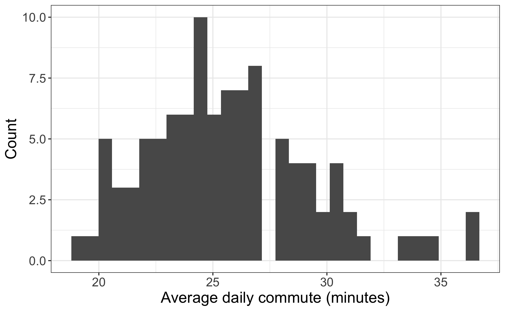

```{r setup, include=FALSE, message=TRUE, warning=FALSE}
knitr::opts_chunk$set(echo = FALSE,
                      out.width = "60%",
                      fig.align = "center")
```

## Introduction
|        On March 30th, 2021, Andy Wu, an Assistant Professor of Business Administration at Harvard Business School published  an explosive research finding, one with huge implications for companies wondering whether to phase out remote work and telecommuting options at the conclusion of the COVID-19 pandemic: *commuting to work adversely affects both quantity and quality of worker output*. Further, the research found that commuting detracts from worker productivity at *any* level of employment. According to Wu, "any distance you can reduce the commute, you can gain in innovative productivity." At the time the study was conducted (2015 to 2017), the average worker in the United States commuted 54 minutes a day-- or 27 minutes each way. That time could prove quite costly; the research also states that “the total opportunity cost of commuting for workers can exceed their hourly wages, amounting to thousands of dollars per average worker per year, and this is before taking into account potential costs on workers’ subjective well-being [1].”
|        That 'subjective' well-being is worth mentioning; Wu's research comes on the heels of others who have established a strong relationship between commute time and health outcomes; those who have longer commutes have been shown to have higher rates of reported physical and mental health complaints [2]. Andy Wu's research, it seems, was further establishing a widely explored phenomenon: those who endure longer daily work commutes experience adverse effects, including lower levels of productivity and both physical and mental health. Already, it is clear that there is an incentivized interest in reducing commute time as long commutes can be detrimental to individual workers and firms which employ them. However, the question remains whether commute times have a strong relationship with other quality-of-life metrics, such as employment figures, population trends, and property tax rates.
|        This analysis will examine North Carolina counties as a case study; in particular, the analysis will seek to determine whether North Carolina counties can reliably be categorized into "quality of life" tiers based on the North Carolina Department of Commerce's 'County Distress Rankings,' which are described in greater detail in the Data section of this paper. Using empirical measurements related to a county's level of suburbanization and business opportunity, the included analyses seek to bolster the claim that worker commutes are not only harmful to individuals, but are also associated writ large with low measures of quality of life within county-level communities. By attaining high levels of predictive accuracy with only county-level commuting data, the case can be furthered that commuting times are indicative of an even wider array of quality-of-life factors. The stated goals of this analysis are as follows:

* Assess the validity of the claim that geographical areas with higher commute times and lower access to employment opportunities are strongly and negatively correlated with metrics often used as indicators for a region's quality of life.

* Attain the best-fit model achieving high predictive accuracy of a county's quality of life tier using only data related to daily work commutes, employment, and levels of urbanization within North Carolina counties as predictors.

* Extend the scope of this research by validating this model using similar commute data and quality of life measures from other states. 

#### Background

|        In the period immediately following the second World War in the United States, several factors combined to aid the the rapid growth of the American suburbs. Among them were technological advances such as construction of freeways, lower transportation and construction costs, and the formation of the Eisenhower Interstate Highway System; government policies which incentivized movement out of city-centers such as the low-interest mortgage programs of the Federal Housing Administration and Veterans Affairs; and other supply side factors such as cheap land around city outskirts in conjuction with emerging contractors and developers [3]. As a result of the same factors, the job sector has been increasingly suburabinzed in the United States since the 1950s. One notable example of this trend, Chicago, lost 211,000 jobs in just the ten years between 1960 and 1970, while the surrouding suburbs gained 548,000 jobs in this time [4].
|        According to Michael Rothstein in his 2018 book *The Color of Law*, people of color were systematically excluded from this suburbanization by explicit practices of both private institutions and government organizations. For example, the aforementioned FHA program relied on maps created by the Home Owners' Loan Corporation and local municipalities which assessed loan risk to be extremely correlated with certain spatial demographic lines. This risk was purportedly high in segregated urban neighborhoods which predominately contained people of color as compared to similar white neighborhoods. As a consequence of being unable to secure low-interest mortgages in new suburban areas, African American and other minority communities were generally unable to partake in the construction of single-family housing units that allowed for mass relocation to the suburbs [5]. Another barrier to the entry of these communities was, ironically, the construction of the Eisenhower Interstate Highway System. Many African Americans and other people of color were, in several cases, driven further from the suburbs by the construction of these interstates when it was used as justification for slum clearance. Even ignoring this fact, there is evidence that the construction of the interstate highway system, while providing and enormous boost to most suburban industries, actually hindered the development of several more primarily urban and rural-based economies [6].
|        Because the suburbanization that occurred during the latter half of the 20th century excluded people of color living in urban communities as well as rural whites, the movement of several employment centers to the suburbs became another barrier of access to skilled and high-wage careers for those demographics. Longer commutes meant higher transportation costs as well as increased time commitments [7]. Additionally, many living in these areas did not have sufficient means of transport (and may not have owned vehicles at all). Lagging public transport progress and the lack of a major rail-transit option in many cities further stunted access to the newly forming suburban industries for several decades, and vehicle ownership and access to public transit continue to be influential factors in local employment rates [8].
|        In an effort to address some of these concerns, Congress authorized the Federal Transit Administration to create the Job Access and Reverse Commute (JARC) Program in 1998. The program had the stated goal of improving "access to transportation services to employment and employment related activities for welfare recipients and eligible low-income individuals and to transport residents of urbanized areas and non-urbanized areas to suburban employment opportunites [9]." In practice, the program involved federal grants to states, local governments, and other non-profit actors aiming to increase public transportation options and career resources for these individuals. JARC was met with limited success and ultimately was repealed in 2012 by President Obama (though many of its functions were replaced by the new Moving Ahead for Progress in the 21st Century Act) [10]. In North Carolina, which receives JARC funding through its Department of Transportation, several localities have participated in the program. These localities are primarily focused on providing for the transportation of low-income, disabled and elderly persons. It is worth noting that, while these programs are helpful in addressing commuting needs of those who would otherwise be excluded from suburban labor markets, they generally do little to address the access needs of the rural and urban populous who do not meet these relatively strict standards and still face obstacles in transportation.

#### Literature Review

|        At the time of the writing of this paper, there has been ample research to suggest that commute times might have a close relationship with some measures traditionally associated with quality of life. As mentioned previously in this paper, work performance is often adversely affected by long commute times. Additionally, both subjective physical and mental health metrics have been shown to be harmed on the individual level as a result of long commutes [11]. It has also been well established that prospective commute times are a significant factor in higher unemployment rates, with those facing higher commute times and costs being more likely to be unemployed. Further research has shown that commute times may have even more broadly scoping effects; overall happiness and satisfaction in career life has been shown to be strongly dependent on commute times [12]. Commute times are even applicable for those not participating in the workforce; students who experience longer daily commutes see lower levels of academic acheivement, which can also be closely associated with quality of life [13].
|        Though the relationship between commute times and certain measures of quality of life has been well-established, it remains to be defined how closely a geographical area's overall quality of life is expected to be related to its residents' daily work commutes. Further, no notable empircal research discovered prior to the writing of this paper has examined North Carolina's specific quality of life measures as they relate to commute times within the state, at the county level or otherwise. The analyses employed in this paper seek to join preexisting research in quantifying just how strongly indicative of quality of life measures daily commuting information can be.

## Data

|        Spatial GIS data for the state of North Carolina and it's county borders have been obtained from the North Carolina Department of Transportation [14]. These data have been joined to the greater dataset by Federal Information Processing Standards (FIPS codes) and will be used solely for the purpose of visualization. All other data used in this analysis come from County and Regional Profiles available on the North Carolina Department of Commerce's website. The Regional Profiles include information on demographics, commuting, education, housing, income, employment, business, and quality of life metrics for each of the 100 counties in the State of North Carolina. For the purposes of this analysis, data on employment and commuting will be considered as predictors. All such data are from the year 2019; because COVID-19 and pandemic-related events are assumed to have been distruptive to regular employment and commuting trends, data from 2020 were not considered for this analysis.
|        The commuting data include percentage of a county's workers with commutes within nine distinct time ranges, average travel time to work, percent working from home, percent carpooling, percent driving alone, percent taking public transit to work, percent biking to work, percent walking to work, percent working outside of county of residence, and percent working outside of North Carolina. Additional data to be used in the predictive model as interactions with various commuting measures will be the proportion of a county's employment for each of a list of job sectors. These sectors include government, construction, retail trade, insurance, professional techinical services, administrative waste services, healthcare and social assistance, and food services. One demographic attribute will be used in the model: the percentage of a county's residents living in urban areas as defined by the 2010 Census. All predictors described above are numeric and standardized to be per-capita measurements for each county
|        The reponse variable, county distress level, is a categorization used by the North Carolina Department of Commerce to indicate a county's relative quality of life. The variable takes one of three levels, with a score of '3' indicating the best relative quality of life and a score of '1' indicating the worst relative quality of life. It is calculated using four important factors in determining a county's overall quality of life: average unemployment rate, median household income, percentage growth in county population (minus prison population), and adjusted property tax base per capita. All four values are calculated for the most recent 12-month period for which data are available. In order to obtain the county distress rankings from these variables, counties are ranked 1-100 for each of the four statistics. Next, each county's total is summed across all four categories. Counties with the lowest totals thus have the lowest distress levels and the highest expected quality of life. The tiers are structured such that the 20 best performing counties are contained in distress level '3', while the 40 worst performing counties are contained in distress level '1', and the remaining 40 counties are in distress level '2'.

#### Exploratory Data Analysis

```{r,echo=FALSE, out.width='.49\\linewidth', fig.width=3, fig.height=3,fig.show='hold',fig.align='center', fig.cap='Maps displaying average commute times and quality of life tiers at the NC county level.'}
knitr::include_graphics(c('figures/commute_map.png', 'figures/qol_map.png'))
```

|        From the maps displayed in \emph{Figure 1}, there does not appear to be a strong correlation between average daily commute time and county distress level (used in this analysis as a proxy for quality of life). Though this presents an obvious challenge in predicting quality of life using commute data, it may not be a significant barrier when using interaction effects to control for other factors, such as proportion of workers in certain industries, usage rates of certain transportation methods, and levels of urbanization. 

```{r fig.cap="Distribution of average daily work commute times for North Carolina counties."}

```

|        The histogram in \emph{Figure 2} displays the distribution of average daily commute time for North Carolina counties. The distibution of these commute times exhibits a slight right skew, with possible outliers including commutes above 30 minutes. However, this data is still roughly normally distributed, and a log-transformation should not be required to meet the normality assumption of regression.  
|        All data included are complete for each of the 100 counties in North Carolina. Further explortory data analysis to be completed will examine multicollinearity in predictors. Some multicollinearity is expected given that there may be close relationships between some variables (for example, various bins of commute times). Because so many commuting and employment variables are being considered, data presenting multicollinearity issues will be excluded for analysis.

## Methods, Preliminary Model, and Next Steps

|        The primary model fit in this analysis will be a proportional odds logistic regression model. This will be acheived using the `MASS` package in *R*. Predictors described in the Data section of this paper will be used, assuming they satisfy further assumptions necessary to perform logistic regression. Any predictors which perfectly predict the outcome, county distress level, will be excluded for the sake of modeling. Model coefficients and associated log-odds ratios will be interpreted for the sake of addressing this paper's stated goal of determining which commute-related factors could be significant indicators of a county's quality of life.
|        Model performance will then be assessed by testing predictive accuracy using *k* holdout sets in **k*-fold cross validation. The model will be further validated by assessing performance on external datasets, such as those containing similar county-level data for other states. In addition to checking the model's validity using cross-validation, the model's performance will be compared to those of other machine-learning methods such as ridge-regression and decision tree modeling. Such methods can be computationally expensive and generally less interpretable, but comparison of the primary model's predictive accuracy to those more advanced methods could further validate the performance of the proportional odds logistic regression model if high predictive accuracy was achieved. 

## Citations

[1] Wu, A. (2021, March 30). Commuting hurts productivity and your best talent suffers most. Retrieved March 31, 2021, from https://hbswk.hbs.edu/item/commuting-kills-productivity-and-your-best-talent-suffers-most

[2] Urhonen, T., Lie, A., & Aamodt, G. (2016). Associations between long commutes and subjective health complaints among railway workers in Norway. Preventive medicine reports, 4, 490-495.

[3] McDonald, J. F. (2015). Postwar urban America: demography, economics, and social policies. New York: Routledge.

[4] Hirsch, E. L. (1986). The creation of political solidarity in social movement organizations. The Sociological Quarterly, 27(3), 373-387.

[5] Rothstein, R. (2018). The color of law: A forgotten history of how our government segregated America. New York: Liveright Publishing Corporation, a division of W. W. Norton & Company.

[6] Chandra, A., & Thompson, E. (2000). Does public infrastructure affect economic activity?: Evidence from the rural interstate highway system. Regional Science and Urban Economics, 30(4), 457-490.

[7] De Vise, P. (1976). The suburbanization of jobs and minority employment. Economic Geography, 52(4), 348-362.

[8] Tyndall, J. (2017). Waiting for the R train: Public transportation and employment. Urban Studies, 54(2), 520-537.

[9] Federal Transit Administration. (2018, December 4). Job access and reverse Commute PROGRAM (5316). Retrieved April 01, 2021, from https://www.transit.dot.gov/funding/grants/grant-programs/job-access-and-reverse-commute-program-5316

[10] Blumenberg, E., & Schweitzer, L. (2006). Devolution and transport policy for the working poor: the case of the US job access and reverse commute program. Planning Theory & Practice, 7(1), 7-25.

[11] Hilbrecht, M., Smale, B., & Mock, S. E. (2014). Highway to health? Commute time and well-being among Canadian adults. World Leisure Journal, 56(2), 151-163.

[12] Olsson, L. E., Gärling, T., Ettema, D., Friman, M., & Fujii, S. (2013). Happiness and satisfaction with work commute. Social indicators research, 111(1), 255-263.

[13] Kobus, M. B., Van Ommeren, J. N., & Rietveld, P. (2015). Student commute time, university presence and academic achievement. Regional Science and Urban Economics, 52, 129-140.

[14] North Carolina Department of Transportation. (2021, March 22). NCDOT County Boundaries. Retrieved March 31, 2021, from https://www.nconemap.gov/datasets/NCDOT::ncdot-county-boundaries/data?geometry=-87.739%2C33.573%2C-71.918%2C36.717

[15] North Carolina Department of Commerce. (2021, January 02). County &amp; Regional Profiles. Retrieved March 31, 2021, from https://www.nccommerce.com/county-regional-profiles

